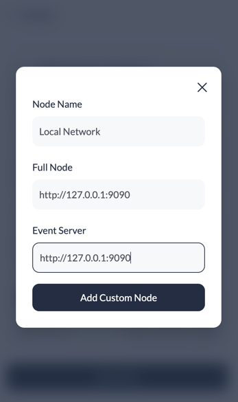

### Prerequisites and setup:

-   [Docker](https://www.docker.com/products/overview) - needed for setup local test envoriment.
-   [Git client](https://git-scm.com/downloads) - needed for clone commands
-   [Nodejs](https://nodejs.org/en) v18.13.0 or higher
-    [TronLink](https://chrome.google.com/webstore/detail/tronlink/ibnejdfjmmkpcnlpebklmnkoeoihofec) chrome extension.
#### If you are on Windows OS please use git bash for running commands.
```
$ npm install --global yarn
```


### Clone the repository<br>
Clone and run this repository you'll need  Docker ,Git and Node.js installed on your computer. From your command line:

```bash
> git clone  git@github.com:adeelch9/workshop_template_project.git 

# Go into the repository
> cd workshop_template_project
```
### Install<br>

### Install Packages for monorepo<br>
Navigate to root directory of TNS ,run command.
```
$ yarn
```
### Compile the Smart Contracts<br>
From root directory of TNS ,run command.
```
$ yarn workspace contracts compile
```

### Initiate local test network.<br>
From root directory of TNS ,run command and keep this running in current terminal.
```
$ yarn workspace contracts test-network
```

### Test the Smart Contracts<br>
From root directory of TNS ,open new terminal and run command.
```
$ yarn workspace contracts test
```

### Deploy the Smart Contracts<br>
First you can change your custom tlds in file.
> contract/migration/2_deploy_contracts.js.

After updating tlds, run command. 

```
$ yarn workspace contracts migrate
```
After this command run successfully. you will see in terminal logs contract address. highled in green background. copy this address and paste in file for variable **TNS_CONTRACT_ADDRESS**
> frontend/src/config/constant/index.ts.

### Start the frontEnd<br>
From root directory of TNS ,run command.
```
$ yarn workspace frontend dev
```

now you can open on browser http://localhost:3000 to play arround with TNS.

### Setup TronLink for local testing.
We need to add local network in TronLink. for this open TronLink extension in chrome. click on setting icon. and click on Nodes. click on Add Node. and fill the form as shown in image below.
<br>



Once node setup we need to import private key in TronLink so we can use test balance for transaction fee.
<br><br>
>**603e5eb10d3d5d53b4bfaa0282d593595683b29c0f5f8f1303e20a6fbac2b3f4**

<br>copy this private key and import as wallet in tron link. 
Now you are ready to test the platform.
